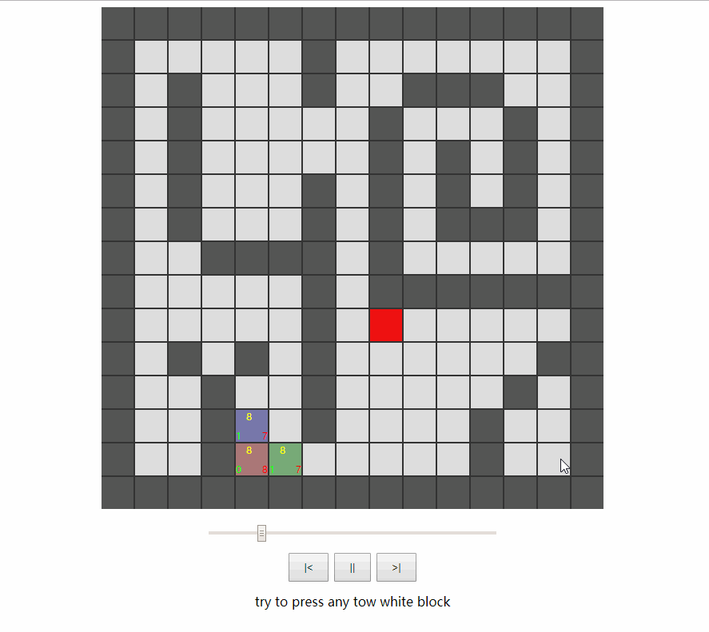

# AStar-Process
The is a Algorithm calculation process Demo of A* (A Star)

Its purpose is to help you understand the A* algorithm quickly and efficiently.

Demo:
https://anseyuyin.github.io/AStar-Process/demo

[](https://anseyuyin.github.io/AStar-Process/demo)

# Features

* you can watch every step of the calculation process

* pause or replay in any timeline


# Usage
if you want use this code 

* Coordinate

The origin of this coordinate system is in the upper left corner, and the max point is in the lower right corner


* Interface
`````javascript
//Find the shortest path between "start" "end" two points ,outPath format is [x,y,x1,y1,x2,y2.........]
findPath(start_x: number, start_y: number, end_x: number, end_y: number, outPath: number[]): boolean;
//Verify the validity of this coordinate externally , if validity need return "true"
outFilter: (x: number, y: number) => boolean;          
`````

aStar.js file path is  /aStar/js/aStar.js

frist load 
````html
<script src="aStar.js"></script>
````
do findPath
````javascript
var astar = new findPath.aStar(); //new aStar object
var outPath = []; //resulte container Array
astar.findPath(1,1,1,8,outPath); //Calculation get path
````
map limit Filter
````javascript
//a temp map
var map = [[1,1,1,1,1,1],
           [1,0,0,0,0,1],
           [1,0,0,0,0,1],
           [1,0,0,0,0,1],
           [1,0,0,0,0,1],
           [1,1,1,1,1,1],]
//set outFilter Filter Function      
astar.outFilter = (x,y)=>{
  return map[y][x] == 0;
}
var outPath = []; //resulte container Array
astar.findPath(1,1,1,8,outPath); //Calculation get path
````
